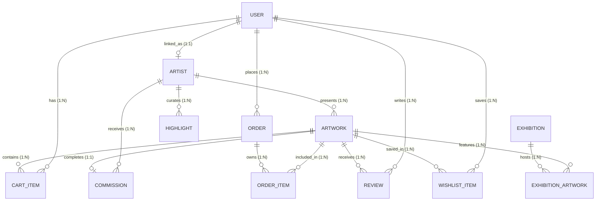

# ArtBro Sketches — Relational Database Architecture & Schema Design

---

## 1. DATABASE DESIGN OVERVIEW
### Simple Explanation
Imagine a library that needs a system to track books, authors, members, and borrowings. If you save everything in a single spreadsheet, you'll end up with massive repetition (e.g., writing the author’s name and bio next to every single book they wrote). If the author changes their bio, you have to find and update every single row.

Relational Database Design solves this by splitting information into logical, separate tables:
* A **User** table for account credentials.
* An **Artist** table for bio and specializations.
* An **Artwork** table for sketches.
* An **Order** table for purchases.

These tables are linked together using **Keys** (IDs), so the data remains consistent and never duplicated. 

### Technical Explanation
The database for **ArtBro Sketches** is built using **MySQL v8** and structured as a highly normalized, relational schema. It enforces referential integrity using **Foreign Key Constraints** and implements **Cascading Actions** to maintain clean database state lifecycle operations. 

---

## 2. ENTITY-RELATIONSHIP DIAGRAM (ERD)

---

## 3. PRISMA MODELS & SPECIFICATIONS

### 3.1 User Model (Core Identity)
* **Purpose:** Handles application credentials, security attributes, and serves as the parent record for e-commerce and gallery interactions.
* **Fields:**
  * `id` (String, Primary Key): Generated using UUIDv4 for absolute uniqueness and protection against sequential ID enumeration.
  * `email` (String, Unique Index): Standardized login identifier.
  * `passwordHash` (String): Secure bcrypt-hashed password.
  * `name` (String): The display name.
  * `role` (Enum): Role-based access control (`SUPER_ADMIN`, `MANAGER`, `ARTIST`, `USER`).
  * `authProvider` (String): Tracks account type (`local` or `google`).
* **Normalization & Relationships:**
  * **One-to-One (1:1) with Artist:** A user can optionally be an artist. Linked via `artistId` mapping to `Artist.id`.
  * **One-to-Many (1:N):** Connected to `CartItem`, `WishlistItem`, `Order`, and `Review`.

### 3.2 Artist Model (Professional Portfolio)
* **Purpose:** Stores public-facing biography, social coordinates, and portfolio details for curators and verified creators.
* **Fields:**
  * `id` (String, Primary Key): UUIDv4 identifier.
  * `name` (String): Public artist name.
  * `bio` (Text): Multi-line biography.
  * `specialization` (String): Artist's main focus areas (e.g., "Pencil portraits").
  * `socialLinks` (Json): JSON block holding variables `{ instagram, behance, twitter }`.
* **Normalization & Relationships:**
  * **One-to-One (1:1) with User:** Bidirectional relation mapping back to the owner's `User` record.
  * **One-to-Many (1:N):** Parent of `Artwork` items, `Commission` requests, and story `Highlight` collections.

### 3.3 Artwork Model (Art & Inventory)
* **Purpose:** Houses specific product catalogs, including prices, medium specs, dimensions, stock levels, and primary images.
* **Fields:**
  * `id` (String, Primary Key): UUIDv4 identifier.
  * `title` (String), `description` (Text), `artworkStory` (Text).
  * `category` (String), `medium` (String), `dimensions` (String).
  * `price` (Float): Retail price.
  * `status` (Enum): Inventory state (`AVAILABLE`, `SOLD`, `UNAVAILABLE`).
  * `image` (String), `images` (Json): Primary image URL and array of secondary detail images.
  * `stock` (Int): Inventory level.
  * `isOriginal` (Boolean): Distinguishes high-value physical sketches from potential print reproductions.
* **Normalization & Relationships:**
  * **Many-to-One (N:1) with Artist:** Linked via `artistId` foreign key.
  * **One-to-One (1:1) with Commission:** Optionally linked via `artworkId` in `Commission` to tie finished commissioned sketches directly back to their request record.
  * **One-to-Many (1:N):** Connects to `CartItem`, `WishlistItem`, `OrderItem`, and `Review` models.

### 3.4 Commission Model (Custom Artwork Requests)
* **Purpose:** Standardizes and tracks custom, user-requested drawings.
* **Fields:**
  * `id` (String, Primary Key): UUIDv4.
  * `clientName`, `email`, `phone` (Strings): Client contact details.
  * `artworkType` (String): e.g., "Realistic Portrait", "Krishna Sketch".
  * `budget` (String), `deadline` (DateTime).
  * `message` (Text), `referenceImage` (String): Detailed request context.
  * `status` (Enum): Tracking stages (`PENDING`, `APPROVED`, `IN_PROGRESS`, `COMPLETED`, `REJECTED`, `REFUNDED`).
  * `shippingAddress`, `shippingCity`, `shippingPincode` (Strings).
  * `advanceAmount` (Float), `paymentStatus` (String).
* **Normalization & Relationships:**
  * **Many-to-One (N:1) with Artist:** Linked via `artistId` to the specific artist executing the custom drawing.
  * **One-to-One (1:1) with Artwork:** Tied to `Artwork` via `artworkId` when the drawing is completed, transforming the custom request into a official inventory listing.

### 3.5 Order & OrderItem Models (E-Commerce Transactions)
* **Purpose:** Represents completed purchases. Splits transactional variables (orders) from dynamic, itemized pricing snapshots (order items) to prevent historical data shifts.
* **Normalization (Separating Header and Details):**
  * `Order` contains the transaction header metadata (total amount, buyer address, order status, payment status, payment method).
  * `OrderItem` contains the itemized records (which specific artworks were bought, the quantities, and the exact price they were sold for at that exact second).
  * **Crucial Design Decision:** Storing the `price` inside `OrderItem` is a fundamental requirement of database design. If the price of an artwork is updated in the `Artwork` table in the future, the historical sales record inside `OrderItem` remains intact, preventing financial reports from shifting.

### 3.6 Exhibition & ExhibitionArtwork Models (Virtual Events)
* **Purpose:** Groups multiple artworks together into online showcases.
* **Mermaid Schema Design for Many-to-Many (M:N):**
  Since an Exhibition can contain many Artworks, and a single Artwork can be part of many different Exhibitions, this establishes an M:N relationship. 
  Instead of compiling arrays inside a database column (which violates 1NF), we resolve this M:N relationship using the **join table** `ExhibitionArtwork`:
  * It maps a compound primary key: `@@id([exhibitionId, artworkId])`
  * Relates to both models using foreign keys with `onDelete: Cascade`, ensuring that if an exhibition is deleted, the join records are cleaned up automatically without affecting the physical artworks.

---

## 4. DATABASE NORMALIZATION COMPLIANCE

### First Normal Form (1NF)
* **Rule:** Every column must hold atomic (indivisible) values, and there must be no repeating groups.
* **Compliance:** The system strictly avoids comma-separated lists. For example, instead of storing multiple artwork image URLs in a raw string, we represent secondary images as a structured, parsed JSON field or separate relational models, and M:N relations are strictly handled using intermediate join tables (`ExhibitionArtwork`).

### Second Normal Form (2NF)
* **Rule:** Must be in 1NF, and all non-key attributes must be fully functionally dependent on the entire primary key (no partial dependencies).
* **Compliance:** All tables use a single-attribute primary key (`id` generated via UUIDv4) or composite primary keys in join tables. Non-key fields like an artwork's `price` or `medium` depend entirely on the specific `Artwork.id`, not a composite set.

### Third Normal Form (3NF)
* **Rule:** Must be in 2NF, and no non-key attribute must be transitively dependent on the primary key (no non-key fields depending on other non-key fields).
* **Compliance:** Consider `User` and `Artist`. Instead of placing the artist's professional bio, specialization, and website inside the `User` table, those fields are extracted into the `Artist` table. The `User` table simply holds an `artistId` reference. This prevents update anomalies where updating a user's account details might corrupt their artist portfolio configuration.

---

## 5. SINGLE SOURCE OF TRUTH (SSOT) DESIGN DECISIONS
### Why `User.profileImage` became the Single Source of Truth
During authentication refactoring, an architectural design choice was made to enforce a **Single Source of Truth (SSOT)** for profile image sync between linked `User` and `Artist` profiles:

1. **The Problem:** In initial drafts, the `User` table and the `Artist` table both maintained independent `profileImage` columns. When a user updated their profile picture inside their dashboard, the change didn't reflect on their public artist portfolio, leading to inconsistent branding and data synchronization errors.
2. **The Solution:** The database design was synchronized so that the backend controllers and seed scripts enforce `User.profileImage` as the absolute source of truth. When a Google OAuth profile picture is fetched or a user uploads a new custom file, the backend synchronizes this value to both tables. 
3. **Database Safeguard:**
   * When registering a regular artist, the system instantiates a profile.
   * On login or update, the system checks and auto-synchronizes the image URL.
   * If a `SUPER_ADMIN` profile is seeded or created, the system executes an `ensureArtistProfile` function, binding the identical `profileImage` string, ensuring complete data parity across administrative and public-facing interfaces.
