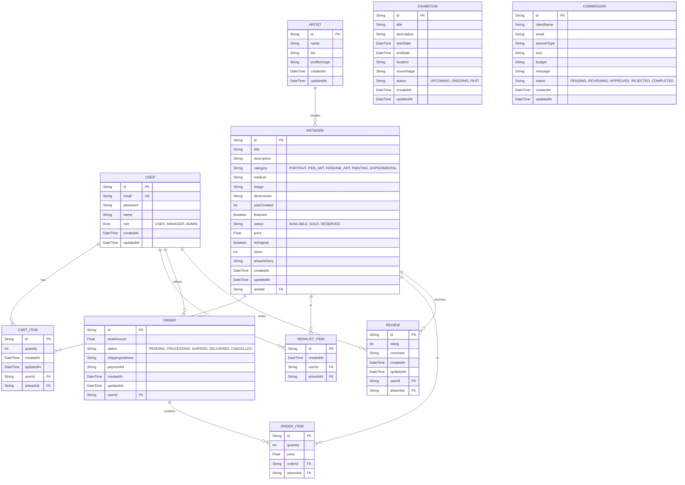

# ArtBro Sketches - Database Entity-Relationship Diagram

This document outlines the database schema architecture for the ArtBro Sketches ecommerce platform, built using Prisma ORM and MySQL.

## Mermaid ER Diagram

## Description of Key Entities

1. **USER**: Stores authentication credentials, profile information, and role-based access control flags (`USER`, `ADMIN`).
2. **ARTWORK**: The core product model. Includes standard gallery fields (medium, dimensions) plus ecommerce fields (`price`, `stock`, `isOriginal`, `status`).
3. **CART_ITEM / WISHLIST_ITEM**: Join tables connecting Users and Artworks, storing user preferences and intent to purchase.
4. **ORDER / ORDER_ITEM**: Immutable records of a completed transaction. `ORDER` stores overall shipping and payment details, while `ORDER_ITEM` locks in the `price` at the time of purchase to protect against future price changes on the artwork.
5. **REVIEW**: Allows users to leave feedback and ratings on purchased artworks.
