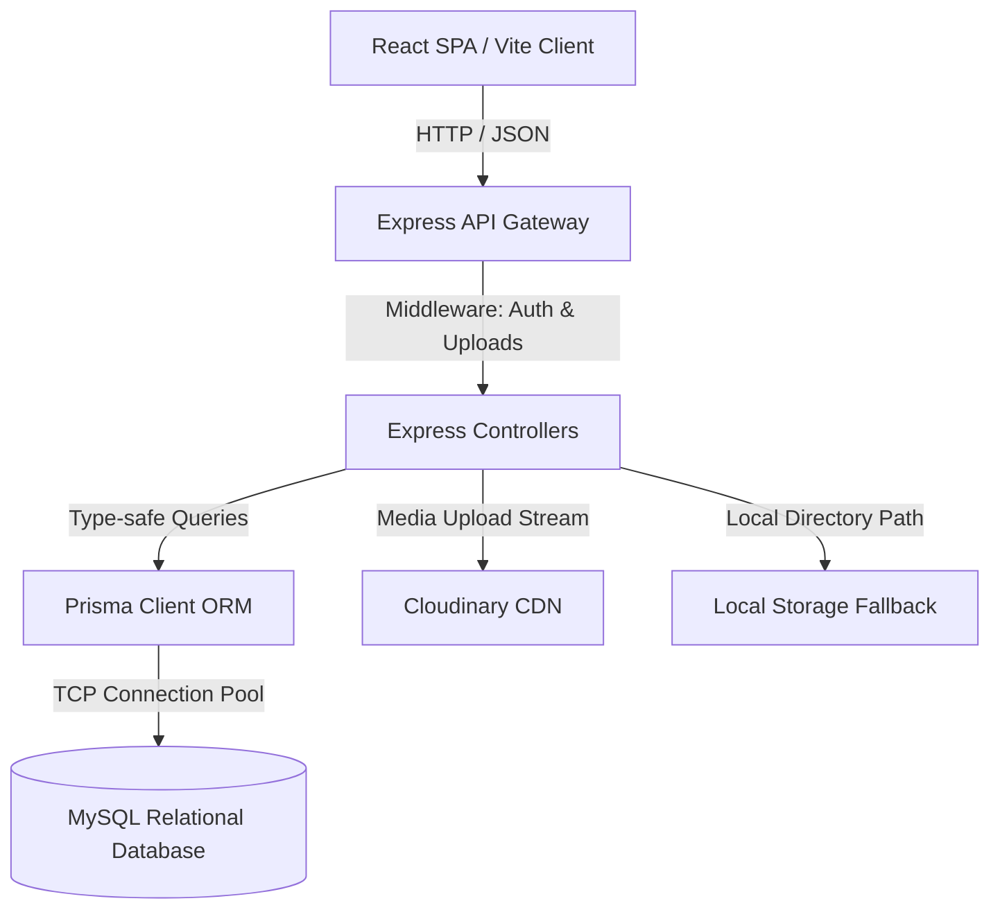
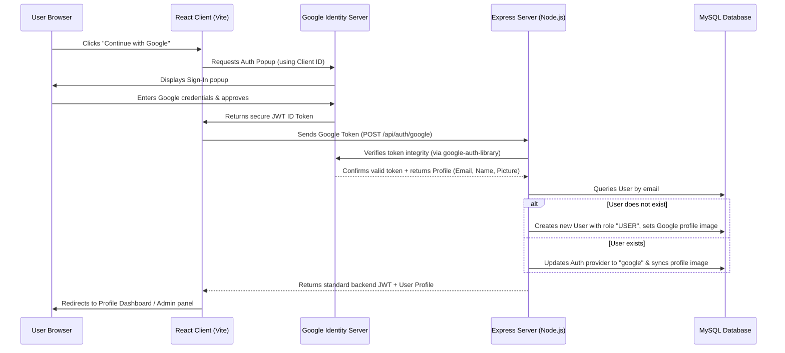

# ArtBro Sketches — System Architecture & Data Flow

---

## 1. ARCHITECTURAL OVERVIEW
### Simple Explanation
Think of **ArtBro Sketches** like a premium restaurant:
* **The Frontend (The Dining Area):** This is what the customer sees. It is beautiful, clean, and decorated with animations. The customer browses the menu (artworks), places an order (cart/checkout), or requests a custom meal (commissions).
* **The Backend (The Kitchen):** Where all the actual work is done. It receives orders from the dining area, verifies who the customer is (authentication), checks if the ingredients are available, and cooks the food.
* **The Database (The Pantry):** The storage room where all ingredients, recipes, and past records are kept. The kitchen constantly reads from and writes to the pantry using a translator (Prisma).

### Technical Explanation
**ArtBro Sketches** is built using a **Decoupled Client-Server Architecture** utilizing standard REST conventions:



This ensures complete separation of concerns. The frontend application is a pure static app that can be hosted on platforms like Vercel or Netlify, while the backend API is hosted on a virtual server (like VPS or AWS EC2), connecting securely to a containerized MySQL database.

---

## 2. FRONTEND/BACKEND COMMUNICATION
### RESTful API Communication
* All communications between the client and the server are done over HTTPS/HTTP using **JSON** as the data exchange format.
* The frontend uses a configured **Axios** client instance (`frontend/src/lib/axios.js`) containing a default baseURL:
  * Local Dev: `http://localhost:5001/api`
  * Production: Set dynamically via `import.meta.env.VITE_API_URL`

### Request and Response Interceptors
To streamline security and token handling, the frontend utilizes **Axios Interceptors**:
1. **Request Interceptor:** Before any API request is sent, this interceptor intercepts the request, grabs the token from the Zustand `authStore` in `localStorage`, and appends it to the headers:
   `Authorization: Bearer <token>`
   Additionally, if the payload is a `FormData` object (used for image uploads), it deletes the default `Content-Type: application/json` header, allowing the browser to automatically set the boundary parameters for multipart data.
2. **Response Interceptor:** If the backend rejects a request with a `401 Unauthorized` status (meaning the token has expired or is invalid), the interceptor automatically catches the error, clears the invalid session, logs the user out, and redirects them to the login screen safely.

---

## 3. THE BACKEND API LIFECYCLE
Every API request made to the Express backend follows a highly structured, linear pipeline:

```
[Client Request] 
       │
       ▼
 1. [Express Router] (Matches URL endpoint, e.g., POST /api/artworks)
       │
       ▼
 2. [Middlewares] 
       ├── a. CORS (Cross-Origin Resource Sharing authorization)
       ├── b. Protect (Validates JWT Token & sets req.user)
       └── c. Multer Upload (Handles file parsing & uploads)
       │
       ▼
 3. [Controller] (Validates request payload, contains core business logic)
       │
       ▼
 4. [Prisma Client] (Executes secure, prepared SQL query on MySQL)
       │
       ▼
 5. [Controller Response] (Returns HTTP Status Code + JSON payload)
       │
       ▼
[Client Browser]
```

---

## 4. AUTHENTICATION & SINGLE SIGN-ON (SSO) FLOWS
### Standard Credentials Authentication Flow
1. **Frontend Submit:** The user enters their email and password in the login form and clicks submit.
2. **Backend Authentication:** The request hits `POST /api/auth/login`. The server queries the `User` table by email. If the user is found, the backend uses `bcrypt.compare()` to compare the plain-text password with the cryptographically hashed password (`passwordHash`) stored in the database.
3. **Token Issuance:** If matches, a stateless JSON Web Token (JWT) is generated containing the user's `id` and `role`. This token is signed using the server-only `JWT_SECRET`.
4. **Client-side Persistence:** The backend returns the user profile details and the signed JWT token. The frontend store receives this data, updates the Zustand state, and saves it in the browser's `localStorage` (`auth-storage`).

### Google OAuth 2.0 Single Sign-On Flow
To provide a fast, secure login experience, the system supports Google SSO:



---

## 5. MEDIA UPLOAD & PERSISTENCE PIPELINE
Uploading physical sketch images requires high-speed streaming and fallback storage. The pipeline works as follows:

```
[Admin Uploads File] ──> [Express Multer Middleware]
                              │
                    ┌─────────┴─────────┐
                    │                   │
         [Has Cloudinary Keys?]   [No Cloudinary Keys?]
                    │                   │
                    ▼                   ▼
         [Stream to Cloud CDN]    [Save to local folder]
                    │            (backend/uploads/artworks/)
                    ▼                   ▼
         [Return CDN secure URL]  [Return local relative path]
                    │                   │
                    └─────────┬─────────┘
                              │
                              ▼
                [Save Path to MySQL Database]
```

* The frontend normalizes both paths using a URL normalizer utility:
  * If the URL starts with `http` (Cloudinary URL), it returns it directly.
  * If the URL is a local relative path, it prepends the backend base URL (e.g., `http://localhost:5001/uploads/artworks/file.jpg`) to serve the image locally.

---

## 6. DOCKER DATABASE SETUP
### Why Docker is Used
Instead of forcing every developer or student to manually install MySQL, configure users, set passwords, and manage schemas (which often breaks across different operating systems like macOS, Windows, and Linux), **Docker** package the entire database in a container.

### The Container Configuration
The `docker-compose.yml` orchestrates the database container:
```yaml
version: '3.8'

services:
  db:
    image: mysql:8
    container_name: artbro-mysql
    restart: always
    environment:
      MYSQL_ROOT_PASSWORD: artbro_root_pass
      MYSQL_DATABASE: art_gallery_db
    ports:
      - "3306:3306"
    volumes:
      - mysql_data:/var/lib/mysql

volumes:
  mysql_data:
```
* **Image (`mysql:8`):** Pulls the official, stable MySQL v8 community server.
* **Ports (`3306:3306`):** Maps the database's internal port `3306` directly to the host machine's port `3306`, making it accessible to Prisma.
* **Volumes (`mysql_data`):** Maps database files inside the container to a persistent virtual disk on the host computer. This guarantees that your data stays intact even if you restart or delete the container!
