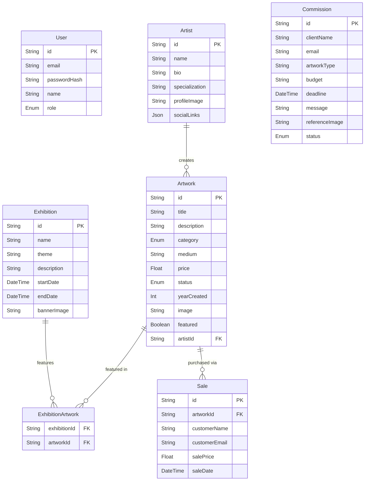

# Entity-Relationship (ER) Diagram

```mermaid
erDiagram
    User {
        String id PK
        String email
        String passwordHash
        String name
        Enum role
    }

    Artist {
        String id PK
        String name
        String bio
        String specialization
        String profileImage
        Json socialLinks
    }

    Artwork {
        String id PK
        String title
        String description
        Enum category
        String medium
        Float price
        Enum status
        Int yearCreated
        String image
        Boolean featured
        String artistId FK
    }

    Exhibition {
        String id PK
        String name
        String theme
        String description
        DateTime startDate
        DateTime endDate
        String bannerImage
    }

    ExhibitionArtwork {
        String exhibitionId FK
        String artworkId FK
    }

    Commission {
        String id PK
        String clientName
        String email
        String artworkType
        String budget
        DateTime deadline
        String message
        String referenceImage
        Enum status
    }

    Sale {
        String id PK
        String artworkId FK
        String customerName
        String customerEmail
        Float salePrice
        DateTime saleDate
    }

    Artist ||--o{ Artwork : "creates"
    Artwork ||--o{ ExhibitionArtwork : "featured in"
    Exhibition ||--o{ ExhibitionArtwork : "features"
    Artwork ||--o{ Sale : "purchased via"
```
